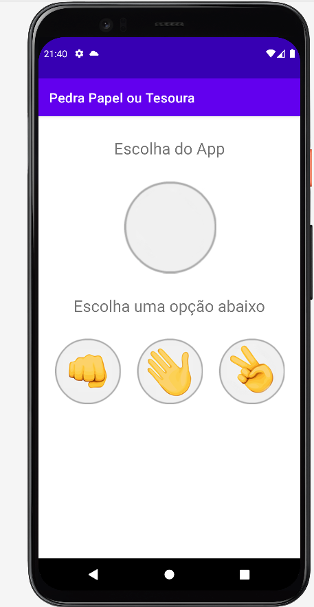

# Apresentação

Este é um aplicativo do famoso jogo Jokenpô, ou como  mais conhecido também Pedra, papel e tesoura.
Eu desenvolvi ele para aperfeiçoamento de conhecimento em aplicativos nativos para Android.

## Recursos explorados no desenvolvimento do APP

* Evento de tempo, para reiniciar a partida
* Posicionamento dos objetos em tela
* Numeros aleatórios.
* Troca de imagem em tempo de execução.
* Troca de texto em tempo de execução.

## Requisitos

* Gradle [https://gradle.org/](https://gradle.org/).
* Java.
* Android Studio mais recente, utilizado a versão Node ultima versão.
* Adb Devices, emulador ou aparelho fisico.

